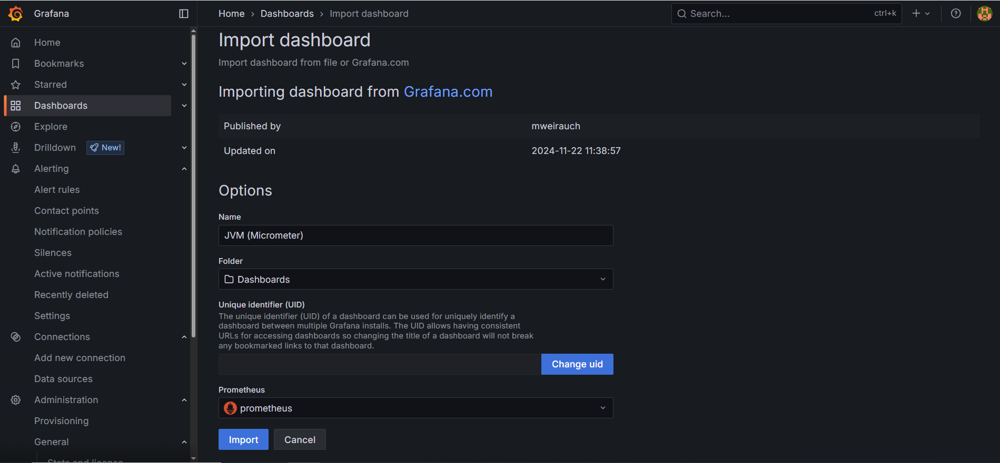

# Case Study - Car Service

<p align="center">
    
</p>

### 📖 Information

<h3>Web URL to Deeplink</h3>
<p>Write an endpoint that converts web URLs to deeplinks.</p>
<ul style="list-style-type:disc;">
  <li>The endpoint should receive a web URL and return a converted deeplink.</li>
  <li>You must store each request and response in persistent storage.</li>
  <li>You should design your table columns or document fields to capture at least:
    <ul>
      <li>Original URL</li>
      <li>Converted deeplink</li>
      <li>Timestamp of request</li>
      <li>Client identifier (if applicable)</li>
    </ul>
  </li>
</ul>

<h4>1. Product Detail Page</h4>
<p>Every product in Trendyol has multiple product detail page URLs. Example format:</p>
<pre><code>https://www.trendyol.com/{BrandName-or-CategoryName}/{ProductName}-p-{ContentId}?boutiqueId={BoutiqueId}&amp;merchantId={MerchantId}</code></pre>
<ul style="list-style-type:disc;">
  <li>Product detail page URL must contain the “-p-” text.</li>
  <li>Product detail page URLs must contain <code>ContentId</code>, located immediately after the “-p-” prefix.</li>
  <li>The URL can optionally include <code>boutiqueId</code> and/or <code>merchantId</code> query parameters.</li>
  <li>If the URL does <em>not</em> contain <code>boutiqueId</code>, do not add <code>CampaignId</code> to the deeplink.</li>
  <li>If the URL does <em>not</em> contain <code>merchantId</code>, do not add <code>MerchantId</code> to the deeplink.</li>
  <li>Note: In deeplinks, the parameter is called <code>CampaignId</code> instead of <code>boutiqueId</code>.</li>
</ul>

<h4>2. Search Page</h4>
<p>Search page URLs must be converted to valid deeplinks. Rules:</p>
<ul style="list-style-type:disc;">
  <li>Search page path must begin with <code>/sr</code>.</li>
  <li>The <code>q</code> query parameter must be converted to the <code>Query</code> parameter in the deeplink.</li>
  <li>Be careful to preserve Turkish characters (percent-encoded values).</li>
</ul>

<h4>3. Other Pages</h4>
<p>All other pages (neither product detail nor search) must be converted to the empty “homepage” deeplink:</p>
<pre><code>ty://?Page=Home</code></pre>

<h4>Example Requests &amp; Responses</h4>
<table border="1" cellpadding="4" cellspacing="0">
  <thead>
    <tr>
      <th>Request (Web URL)</th>
      <th>Response (Deeplink)</th>
    </tr>
  </thead>
  <tbody>
    <tr>
      <td>
        <code>https://www.trendyol.com/casio/saat-p-1925865?boutiqueId=439892&amp;merchantId=105064</code>
      </td>
      <td>
        <code>ty://?Page=Product&amp;ContentId=1925865&amp;CampaignId=439892&amp;MerchantId=105064</code>
      </td>
    </tr>
    <tr>
      <td>
        <code>https://www.trendyol.com/casio/erkek-kol-saat-p-1925865</code>
      </td>
      <td>
        <code>ty://?Page=Product&amp;ContentId=1925865</code>
      </td>
    </tr>
    <tr>
      <td>
        <code>https://www.trendyol.com/casio/erkek-kol-saat-p-1925865?boutiqueId=439892</code>
      </td>
      <td>
        <code>ty://?Page=Product&amp;ContentId=1925865&amp;CampaignId=439892</code>
      </td>
    </tr>
    <tr>
      <td>
        <code>https://www.trendyol.com/casio/erkek-kol-saat-p-1925865?merchantId=105064</code>
      </td>
      <td>
        <code>ty://?Page=Product&amp;ContentId=1925865&amp;MerchantId=105064</code>
      </td>
    </tr>
    <tr>
      <td>
        <code>https://www.trendyol.com/sr?q=elbise</code>
      </td>
      <td>
        <code>ty://?Page=Search&amp;Query=elbise</code>
      </td>
    </tr>
    <tr>
      <td>
        <code>https://www.trendyol.com/sr?q=%C3%BCt%C3%BC</code>
      </td>
      <td>
        <code>ty://?Page=Search&amp;Query=%C3%BCt%C3%BC</code>
      </td>
    </tr>
    <tr>
      <td>
        <code>https://www.trendyol.com/Hesabim/Favoriler</code>
      </td>
      <td>
        <code>ty://?Page=Home</code>
      </td>
    </tr>
    <tr>
      <td>
        <code>https://www.trendyol.com/Hesabim/#/Siparislerim</code>
      </td>
      <td>
        <code>ty://?Page=Home</code>
      </td>
    </tr>
  </tbody>
</table>

<hr />

<h3>Deeplink to Web URL</h3>
<p>Write an endpoint that converts deeplinks back to web URLs. Use the same rules from Task 2 in reverse.</p>
<ul style="list-style-type:disc;">
  <li>The endpoint should receive a deeplink and return the corresponding web URL.</li>
  <li>You must store each request and response in persistent storage.</li>
  <li>You should design your table columns or document fields to capture at least:
    <ul>
      <li>Original deeplink</li>
      <li>Converted web URL</li>
      <li>Timestamp of request</li>
      <li>Client identifier (if applicable)</li>
    </ul>
  </li>
</ul>

<h4>Conversion Rules</h4>
<ul style="list-style-type:disc;">
  <li><strong>Product Page Deeplink:</strong>
    <ul>
      <li><code>Page=Product</code> with <code>ContentId</code> must map to a Trendyol product detail URL.</li>
      <li>If <code>CampaignId</code> is present, include <code>boutiqueId={CampaignId}</code> in the web URL.</li>
      <li>If <code>MerchantId</code> is present, include <code>merchantId={MerchantId}</code> in the web URL.</li>
      <li>Replace <code>ty://?Page=Product&ContentId={ContentId}</code> with:
        <pre><code>https://www.trendyol.com/brand/name-p-{ContentId}</code></pre>
        (Note: you may substitute a placeholder <code>brand/name</code> or derive from stored data if available.)
      </li>
    </ul>
  </li>
  <li><strong>Search Page Deeplink:</strong>
    <ul>
      <li><code>Page=Search</code> with <code>Query={q}</code> must map to:
        <pre><code>https://www.trendyol.com/sr?q={q}</code></pre>
      </li>
    </ul>
  </li>
  <li><strong>Favorites / Orders Deeplinks:</strong>
    <ul>
      <li><code>ty://?Page=Favorites</code> or <code>ty://?Page=Orders</code> (and any other non-product, non-search deeplink) both map to the homepage:
        <pre><code>https://www.trendyol.com</code></pre>
      </li>
    </ul>
  </li>
</ul>

<h4>Example Requests &amp; Responses</h4>
<table border="1" cellpadding="4" cellspacing="0">
  <thead>
    <tr>
      <th>Request (Deeplink)</th>
      <th>Response (Web URL)</th>
    </tr>
  </thead>
  <tbody>
    <tr>
      <td>
        <code>ty://?Page=Product&amp;ContentId=1925865&amp;CampaignId=439892&amp;MerchantId=105064</code>
      </td>
      <td>
        <code>https://www.trendyol.com/brand/name-p-1925865?boutiqueId=439892&amp;merchantId=105064</code>
      </td>
    </tr>
    <tr>
      <td>
        <code>ty://?Page=Product&amp;ContentId=1925865</code>
      </td>
      <td>
        <code>https://www.trendyol.com/brand/name-p-1925865</code>
      </td>
    </tr>
    <tr>
      <td>
        <code>ty://?Page=Product&amp;ContentId=1925865&amp;CampaignId=439892</code>
      </td>
      <td>
        <code>https://www.trendyol.com/brand/name-p-1925865?boutiqueId=439892</code>
      </td>
    </tr>
    <tr>
      <td>
        <code>ty://?Page=Product&amp;ContentId=1925865&amp;MerchantId=105064</code>
      </td>
      <td>
        <code>https://www.trendyol.com/brand/name-p-1925865?merchantId=105064</code>
      </td>
    </tr>
    <tr>
      <td>
        <code>ty://?Page=Search&amp;Query=elbise</code>
      </td>
      <td>
        <code>https://www.trendyol.com/sr?q=elbise</code>
      </td>
    </tr>
    <tr>
      <td>
        <code>ty://?Page=Search&amp;Query=%C3%BCt%C3%BC</code>
      </td>
      <td>
        <code>https://www.trendyol.com/sr?q=%C3%BCt%C3%BC</code>
      </td>
    </tr>
    <tr>
      <td>
        <code>ty://?Page=Favorites</code>
      </td>
      <td>
        <code>https://www.trendyol.com</code>
      </td>
    </tr>
    <tr>
      <td>
        <code>ty://?Page=Orders</code>
      </td>
      <td>
        <code>https://www.trendyol.com</code>
      </td>
    </tr>
  </tbody>
</table>


### Explore Rest APIs

Endpoints Summary
<table style="width:100%; border-collapse: collapse;" border="1">
   <tr>
      <th>Method</th>
      <th>Url</th>
      <th>Description</th>
      <th>Request Body</th>
      <th>Path Variable</th>
      <th>Response</th>
   </tr>
   <tr>
      <td>POST</td>
      <td>/api/v1/convert/url</td>
      <td>Convert a web URL into a deep link</td>
      <td>ConversionRequest</td>
      <td>—</td>
      <td>CustomResponse&lt;ConversionResponse&gt;</td>
   </tr>
   <tr>
      <td>POST</td>
      <td>/api/v1/convert/deeplink</td>
      <td>Convert a deep link into a web URL</td>
      <td>ConversionRequest</td>
      <td>—</td>
      <td>CustomResponse&lt;ConversionResponse&gt;</td>
   </tr>
</table>


### Technologies

---
- Java 21
- Spring Boot 3.0
- Restful API
- Open Api (Swagger)
- Maven
- Junit5
- Mockito
- Integration Tests
- Docker
- Docker Compose
- CI/CD (Github Actions)
- Postman
- Prometheus
- Grafana
- Sonarqube
- Kubernetes
- JaCoCo (Test Report)

### Postman

```
Import postman collection under postman_collection folder
```


### Prerequisites

#### Define Variable in .env file

```
LINKCONVERTER_SERVICE_DB_IP=localhost
LINKCONVERTER_SERVICE_DB_PORT=3306
DATABASE_USERNAME={MY_SQL_DATABASE_USERNAME}
DATABASE_PASSWORD={MY_SQL_DATABASE_PASSWORD}

```

### Open Api (Swagger)

```
http://localhost:5150/swagger-ui/index.html
```

---

### JaCoCo (Test Report)

After the command named `mvn clean install` completes, the JaCoCo report will be available at:
```
target/site/jacoco/index.html
```
Navigate to the `target/site/jacoco/` directory.

Open the `index.html` file in your browser to view the detailed coverage report.

---

### Maven, Docker and Kubernetes Running Process


### Maven Run
To build and run the application with `Maven`, please follow the directions shown below;

```sh
$ cd linkconverter
$ mvn clean install
$ mvn spring-boot:run
```

---

### Docker Run
The application can be built and run by the `Docker` engine. The `Dockerfile` has multistage build, so you do not need to build and run separately.

Please follow directions shown below in order to build and run the application with Docker Compose file;

```sh
$ cd linkconverter
$ docker-compose up -d
```

If you change anything in the project and run it on Docker, you can also use this command shown below

```sh
$ cd linkconverter
$ docker-compose up --build
```

To monitor the application, you can use the following tools:

- **Prometheus**:  
  Open in your browser at [http://localhost:9090](http://localhost:9090)  
  Prometheus collects and stores application metrics.

- **Grafana**:  
  Open in your browser at [http://localhost:3000](http://localhost:3000)  
  Grafana provides a dashboard for visualizing the metrics.  
  **Default credentials**:
    - Username: `admin`
    - Password: `admin`

- **AlertManager**:  
  Open in your browser at [http://localhost:9093](http://localhost:9093)

Define prometheus data source url, use this link shown below

```
http://prometheus:9090
```

---


### Kubernetes Run
To run the application, please follow the directions shown below;

- Start Minikube

```sh
$ minikube start
```

- Open Minikube Dashboard

```sh
$ minikube dashboard
```

- To deploy the application on Kubernetes, apply the Kubernetes configuration file underneath k8s folder

```sh
$ kubectl apply -f k8s
```

- To open Prometheus, click tunnel url link provided by the command shown below to reach out Prometheus

```sh
minikube service prometheus-service
```

- To open Grafana, click tunnel url link provided by the command shown below to reach out Prometheus

```sh
minikube service grafana-service
```

- To open AlertManager, click tunnel url link provided by the command shown below to reach out Prometheus

```sh
minikube service alertmanager-service
```

- Define prometheus data source url, use this link shown below

```
http://prometheus-service.default.svc.cluster.local:9090
```


### Sonarqube

- Go to `localhost:9000` for Docker and Go there through `minikube service sonarqube` for Kubernetes
- Enter username and password as `admin`
- Change password
- Click `Create Local Project`
- Choose the baseline for this code for the project as `Use the global setting`
- Click `Locally` in Analyze Method
- Define Token
- Click `Continue`
- Copy `sonar.host.url` and `sonar.token` (`sonar.login`) in the `properties` part in  `pom.xml`
- Run `mvn sonar:sonar` to show code analysis


---
### Docker Image Location

```
https://hub.docker.com/repository/docker/noyandocker/carservice/general
```

### Screenshots

<details>
<summary>Click here to show the screenshots of project</summary>
    <p> Figure 1 </p>
    
    <p> Figure 2 </p>
    
    <p> Figure 3 </p>
    
    <p> Figure 4 </p>
    
    <p> Figure 5 </p>
    
    <p> Figure 6 </p>
    
    <p> Figure 7 </p>
    
    <p> Figure 8 </p>
    
    <p> Figure 9 </p>
    
    <p> Figure 10 </p>
    
    <p> Figure 11 </p>
    
    <p> Figure 12 </p>
    
    <p> Figure 13 </p>
    
    <p> Figure 14 </p>
    
    <p> Figure 15 </p>
    
    <p> Figure 16 </p>
    
    <p> Figure 17 </p>
    
    <p> Figure 18 </p>
    
    <p> Figure 19 </p>
    
    <p> Figure 20 </p>
    
    <p> Figure 21 </p>
    
    <p> Figure 22 </p>
    
    <p> Figure 23 </p>
    
    <p> Figure 24 </p>
    
    <p> Figure 25 </p>
    
    <p> Figure 26 </p>
    
    <p> Figure 27 </p>
    
    <p> Figure 28 </p>
    
    <p> Figure 29 </p>
    
    <p> Figure 30 </p>
    
    <p> Figure 31 </p>
    
    <p> Figure 32 </p>
</details>


### Contributors

- [Sercan Noyan Germiyanoğlu](https://github.com/Rapter1990)